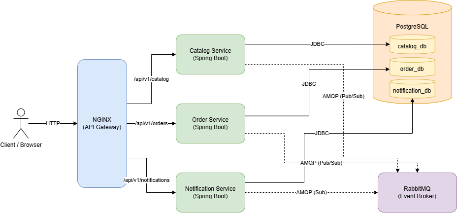

# AgriMarket

AgriMarket is a microservices-based application designed to manage the catalog, orders, and notifications for an agricultural marketplace. The system is built using Spring Boot and relies on a containerized infrastructure.

## System Architecture

The architecture consists of three main Spring Boot microservices, an API Gateway, a relational database, and a message broker for asynchronous communication. 



### Components

1. **API Gateway (NGINX)**
   Acts as the single entry point for clients. It routes incoming HTTP requests on port 80 to the appropriate backend microservice based on the URL path (`/api/v1/catalog`, `/api/v1/orders`, `/api/v1/notifications`).

2. **Catalog Service**
   Handles the product catalog and inventory management. It manages product listings, prices, and stock availability. Connected to its dedicated `catalog_db` schema.

3. **Order Service**
   Manages the order lifecycle, from creation to fulfillment or cancellation. It handles shipping cost calculation and interacts with the Catalog Service asynchronously to reserve inventory. Connected to its dedicated `order_db` schema.

4. **Notification Service**
   Listens for domain events (e.g., OrderConfirmed, OrderCancelled) and processes user notifications. Connected to its dedicated `notification_db` schema.

5. **PostgreSQL**
   The primary data store. A single PostgreSQL instance hosts logical databases for each microservice to ensure data isolation while minimizing infrastructure overhead in the development environment.

6. **RabbitMQ**
   The message broker enabling asynchronous communication between services. It facilitates the Saga pattern for distributed transactions (such as coordinating order placement and inventory reservation) and the Outbox pattern for reliable event publishing.

## Getting Started

### Prerequisites
- Docker and Docker Compose
- Windows Subsystem for Linux (WSL) or a Bash-compatible terminal

### Running the Application
The application can be started entirely through Docker. Navigate to the `agrimarket` directory and execute:

```bash
docker compose up -d --build
```

### Running E2E Tests
A shell script is provided to run end-to-end tests against the API Gateway. Ensure the containers are healthy before executing:

```bash
bash test_e2e.sh
```
